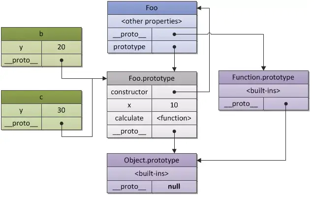

- [FE-interview](#fe-interview)
  - [HTML](#html)
  - [CSS](#css)
    - [CSS选择器](#CSS选择器)
    - [什么是BFC,BFC有什么用](#什么是BFC,BFC有什么用)
    - [display:none与visibility:hidden区别](#display:none与visibility:hidden区别)
  - [JS](#JS)
   - [JS基础数据类型](#JS基础数据类型)
   - [typeof返回值](#typeof返回值)
  - [框架](#frame)
  - [算法和数据结构](#算法和数据结构)
    - [数组](#数组)
    - [栈](#栈)
    - [队列](#队列)
    - [链表](#链表)
  - [web综合知识点](#web综合知识)

  # FE-interview
    这是我个人复习前端知识收集和整理的资料, 希望在阅读文章的朋友, 这篇文章也能帮助到你
  
  ## HTML
  ## CSS
    ### CSS选择器
    1231321
    ### 什么是BFC,BFC有什么用
    BFC(block formatting context)直译为块级格式上下文。

    怎么才能触发BFC
    1. 根元素
    2. float属性不为none;
    3. display属性为 inline-block, table-cell, inline-flex
    4. position属性不为 static, relative
    5. overflow属性不为 visible

    BFC的规则
    1. 内部的盒子会在垂直方向上一个接一个放置
    2. 垂直方向的距离由margin决定(属于同一个BFC的两个相邻盒子之间margin会发生重叠)
    3. 每个元素的margin box的左边， 与包含块border box的左边相接触(对于从左往右的格式化，否则相反)。即使存在浮动也是如此。
    4. BFC区域不会和float的元素重叠
    5. 计算BFC的高度时，浮动子元素也参与计算
    6. BFC就是页面上的一个隔离的独立容器，容器里面的子元素不会影响到外面元素，反之亦然
看到以上的几条约束。

  利用BFC的规则可以实现一些常见的效果
  1. 不合浮动元素重合 如： 自适应两栏布局
  2. 图片文本环绕
  3. 清除盒子内浮动带来影响
  4. 解决垂直方向的margin坍塌

  ### display:none与visibility:hidden区别
  相同点: 它们都能让元素不可见
  区别：
  1. display:none; 会让元素完全从渲染树中消失，渲染的时候不占据任何空间；visibility: hidden;不会让元素从渲染树消失，渲染时元素继续占据空间，只是内容不可见。
  2. display: none;是非继承属性，子孙节点消失由于元素从渲染树消失造成，通过修改子孙节点属性无法显示；visibility: hidden;是继承属性，子孙节点由于继承了 hidden 而消失，通过设置 visibility: visible，可以让子孙节点显示。
  3. 修改常规流中元素的 display 通常会造成文档重排。修改 visibility 属性只会造成本元素的重绘。
  ## JS
    ### JS基础数据类型
    基本数据类型，Number、String、Boolean、Undefined、Null、Symbol ，BigInt。
    引用数据类型： Object (function、Array、Date等都属于Object)
    ### typeof返回值
    123
    ### JS原型
    js中，我们通常会使用构造函数来创建一个对象，每一个构造函数的内部都有一个prototype属性，这个属性对应的值是一个对象，这个对象它包含了可以由该构造函数的所有实例都共享的属性和方法，我们把它称为原型。
    原型分为显示原型和隐式原型，一般称prototype为显示原型，__proto__称为隐式原型。
    
  ## webpack
  ## node
  ## frame
  ## 算法和数据结构
       数据结构是ADT(抽象数据类型 Abstract Data Type)的物理实现
    ### 数组
    原生JS已经实现数组不在扩展

    数组的优点：
    1. 可以通过下标访问，查找速度快
    数组的缺点:
    1. 数组的扩容慢（在高级语言里，扩展数组长度可能需要开辟新的空间，把原来的数组里的数据再拷贝到新数组的空间里）
    2. 数组的插入和删除效率比较低 （插入数据和删除数据需要移动数组操作下标之后的所有元素）
    ### 栈
    栈是一种受限的线性表，表现为后进先出(LIFO).
    1. 其限制是仅允许在表的一端进行插入和删除运算.这一端被称为栈顶，相对的把另一端称为栈底。
    2. LIFO(last in first out)表示就是后进入的元素，第一个弹出栈空间。
    3. 向一个栈插入新元素又称为进栈、入栈或者压栈，它是把新元素放到栈顶元素的上面,使之成为新的栈顶元素。
    4. 从一个栈删除元素又称为出栈或者退栈，它是把栈顶元素删掉,使其相邻的元素成为新的栈顶元素。

    常见题型： 
    有六个元素6、5、4、3、2、1的顺序进栈，问哪个是不合法的出栈顺序（） // C  
    A. 5 4 3 6 1 2   B. 4 5 3 2 1 6 C. 3 4 6 5 2 1 D. 2 3 4 1 5 6  

    栈的实现
    ```
    function Stack() {
      this.items = []
      // 入栈
      Stack.prototype.push = function(element) {
        this.items.push(element)
      }
      // 出栈
      Stack.prototype.pop = function(element) {
        return this.items.pop()
      }
      // 查看栈顶元素
      Stack.prototype.peek = function(element) {
        return this.items(this.items.length -1)
      }
      // 判断栈是否为空
      Stack.prototype.isEmpty = function(element) {
        return this.items.length === 0
      }
      // 获取栈里的元素数量
      Stack.prototype.size = function(element) {
        return this.items.length
      }
      Stack.prototype.toString = function(element) {
        let resString = ''
        this.items.forEach(item => {
          resString = `${resString}  ${item}`
        })
        return resString
      }
    }

    let stack = new Stack()
    ```
    栈的应用案例

    实现十进制转二进制
    ```
      function(decNumber) {
        let stack = new Stack()
        while(decNumber > 0) {
          stack.push(docNumber % 2)
          docNumber = Math.floor(docNumber / 2)
        }
        let binaryString = ''
        while(!stack.isEmpty()) {
          binaryString += stack.pop()
        }
        return binaryString
      }
    ```
  ### 队列
  队列是一种受限的线性表，表现为先进先出(FIFO first in first out).
  1. 受限之处在于它只允许在表的前端进行删除
  2. 在表的后端进行插入操作  

  队列的实现
  ```
  function Queue() {
    this.items = []
    // 进队列
    Queue.prototype.enqueue = function(element) {
      this.items.push(element)
    }
    // 出队列
    Queue.prototype.dequeue = function() {
      return this.items.shift()
    }
    // 查看头部元素
    Queue.prototype.front = function() {
      return this.items[0]
    }
    // 判断栈是否为空
    Queue.prototype.isEmpty = function() {
      return this.items.length === 0
    }
    // 获取队列里的元素数量
    Queue.prototype.size = function() {
      return this.items.length
    }
    Queue.prototype.toString = function(element) {
      let resString = ''
      this.items.forEach(item => {
        resString = `${resString}  ${item}`
      })
      return resString
    }
  }
  ```
  队列的应用案例

  击鼓传花游戏：
  几个朋友一起玩一个游戏，围成一圈，开始数数，数到某个数字的人自动淘汰。最后剩下的人会胜利，请问最后剩下的是在原来哪个位置上的人?
  ```
  function passGame(nameList, num) {
    let queue = new Queue()
    for(let i = 0; i < nameList.length; i++) {
      queue.enqueue(nameList[i])
    }
    
    while(queue.size() > 1) {
      for(let i = 0; i < num -1; i++ ) {
        queue.enqueue(queue.dequeue())
      }
      queue.dequeue()
    }

    let endName = queue.front()
    return nameList.indexOf(endName)
  }

  const nameList = ['小明', '小黄', '小红']
  const index = passGame(nameList, 6)
  ```

  ### 优先级队列
    顾名思义，优先级队列是一个有特俗排列的队列，比起普通队列优先级队列插入时会考虑数据的优先级

    常见案例如登机顺序，头等舱先于经济舱，再如急诊先于普通门诊处理

    优先级队列的实现
    ```
    function PriorityQueue() {
      function QueueElement(element, priority) {
        this.element = element
        this.priority = priority
      }
      // 封装属性
      this.items = []
      // 实现插入方式
      PriorityQueue.prototype.enqueue = function(element, priority) {
        const queueElement = new QueueElement(element, priority)
        if (!this.items.length) {
          this.items.push(queueElement)
        } else {
          let added = false
          for(let i < 0; i < this.items.length; i++) {
            if (queueElement.priority < this.items[i]) {
              this.items.splice(i, 0, queueElement)
              added = true
              break
            }
          }
          if (!added) {
            this.items.push(queueElement)
          }
        }
      }
    }
    ```
  ### 链表
  链表和数组一样是用来存储多个元素的表结构,单链表的元素在内存中不必是连续的空间。链表的每个元素由一个存储元素本身的节点和一个指向下一个元素的引用(指针)组成。

  相对数组链表的优点：
  1. 内存空间不是连续的。可以充分利用计算机的内存，实现灵活的内存动态管理。
  2. 链表不必在创建时就确定大小，并且只要计算机内存允许，就可以无限的延申下去。
  3. 链表在插入和删除数据时，时间复杂度可以达到O(1).相对数组效率高很多。
  相对数组链表的缺点:
  1. 链表访问任意一个位置元素时,都需要从头开始访问。

  链表的实现
  ```
  function LinkedList() {
    this.head = null
    this.length = 0
    function Node(data) {
      this.data = data
      this.next = null
    }
    // 尾部添加
    LinkedList.prototype.append = function(data) {
      let newNode = new Node(data)
      if (!this.length) {
        this.head = newNode
      } else {
        let current = this.head
        while(current.next) {
          current = current.next
        }
        current.next = newNode
      }
      this.length += 1
    }
    LinkedList.prototype.toString = function() {
      let  = ''
      let current = this.head
      while(current) {
         resString = `${current.data}  ${item}`
         current = current.next
      }
      return resString
    }
    // 插入节点
    LinkedList.prototype.insert = function(pos, data) {
      if (pos < 0 || pos > this.length) {
        return false
      }
      let newNode = new Node(data)
      if (this.length ===0) {
        newNode.next = this.head
        this.head = newNode
      } else {
        let index = 0
        let previous.next = null
        while(index++ < position) {
          previous = current
          current = current.next
        }
        newNode.next = current
        previous.next = newNode
      }
      this.length +=1
      return true
    }
    // 获取下标元素
    LinkedList.prototype.get = function(pos) {
      if (pos < 0 || pos >= this.length) return null
      let current = this.head
      let index = 0
      while(index++ < pos>) {
        current = current.next
      }
      return current.data
    }
    // 判断是否存在返回索引
    LinkedList.prototype.indexOf = function(data) {
      let current = this.head
      let index = 0
      while(current) {
        if (current.data == data) {
          return index
        }
        current = current.next
        index++
      }
      return -1
    }
    // 修改元素
    LinkedList.prototype.update = function(pos, newData) {
      if (pos < 0 || pos >= this.length) return false
      const current = this.head
      const index = 0
      while(index++ < pos) {
        current = current.next
      }
      current.data = newData
      return true
    }
    // 删除指定位置元素
    LinkedList.prototype.removeAt = function(pos) {
      if (pos < 0 || pos >= this.length) return false
      let current = this.head
      if (pos === 0) {
        this.head = this.head.next
      } else {
        let index = 0
        let previous = null
        while(index++ < position) {
          previous = current
          current = current.next
        }
        previous.next = current.next
      }
      this.length -= 1
      return current.data
    }
    // 删除元素
    LinkedList.prototype.remove = function(data) {
      let pos = this.indexOf(data)
      return this.removeAt(pos)
    }
    LinkedList.prototype.isEmpty = function() {
      return this.length === 0
    }
    LinkedList.prototype.size = function() {
      return this.length
    }
  }

  ```
  ### 双向链表
  链表是单向遍历的,有些情况下为了能返回到上一个节点，就出现了双向链表。双向链表既可以从头遍历也可以从尾部遍历。

  双向链表的优缺点：
  1. 链表的访问可以是双向的，既可以向前也可以向后
  2. 每次插入或者删除某个节点的时候,需要处理4个引用,而不是2个，实现比单项链表稍微复杂一些。
  3. 相对单向链表多占用一些内存空间。

  双向链表的实现
  ```
  function() {
    DoublyLinkedList = function() {
      this.head = null
      this.tail = null
      this.length = 0
      function Node(data) {
        this.prev = null
        thi.next = null
        this.data = data
      }
      // 尾部添加
      DoublyLinkedList.prototype.append = function(data) {
        let newNode = new Node(data)
        if (this.head === null) {
          this.head = newNode
          this.tail = newNode
        } else {
          this.tail.next = newNode
          newNode.prev = this.tail
          this.tail = newNode
        }
        this.length++
      }
      DoublyLinkedList.prototype.insert = function(pos, data) {
        if (pos < 0 || pos > this.length) return false
        let newNode = new Node(data)
        if (this.length ===0) {
          this.head = newNode
          this.tail = newNode
        } else {
          if (pos === 0) {
            this.head.prev = newNode
            newNode.next = this.head
            this.head= newNode
          } else if (pos === this.length) {
            this.tail.next = this.tail
            this.tail.next = newNode
            thi.tail = newNode
          } else {
            let current = this.head
            let previous = null
            let index = 0
            while(index++ < pos) {
              previous = current
              current = current.next
            }
            newNode.next = current
            newNode.prev = previous
            current.prev = newNode
            previous.next = newNode
          }
          this.length++
          return true
        }
      }
      根据位置删除对应的元素
      DoublyLinkedList.prototype.removeAt = function (pos) {
        if (pos < 0 || pos > this.length) return null
        let current = this.head
        if (pos === 0) {
          if (this.length === 1) {
            this.head = null
            this.tail = null
          } else {
            this.head = this.head.next
            this.head.prev = null
          }
        } else if (pos === this.length -1) {
          current = this.tail
          this.tail = this.tail.prev
          this.tail.next = null
        } else {
          let index = 0
          let previous = null
          while(index++ < pos) {
            previous = current
            current = current.next
          }
          previous.next = current.next
          current.next.previous = previous
        }
        this.length--
        return current.data
      }
      // 根据元素获取在链表中的位置
      DoublyLinkedList.prototype.indexOf = function (data) {
        let current = this.head
        let index = 0
        while(current) {
          if (current.element === element) {
            return index
          }
          current = current.next
          index++
        }
        return -1
      }
      // 根据元素删除
      DoublyLinkedList.prototype.remove = function (data) {
        var index = this.indexOf(data)
        return this.removeAt(index)
      }
      // 判断是否为空
      DoublyLinkedList.prototype.isEmpty = function () {
          return this.length === 0
      }
      // 获取链表长度
      DoublyLinkedList.prototype.size = function () {
          return this.length
      }
    }
  }
  ```
  ## web综合知识